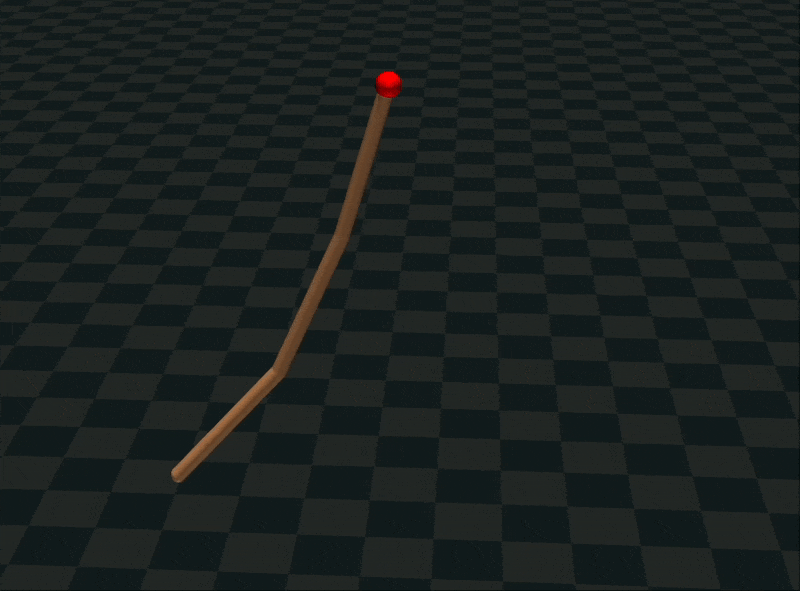

# Hinge Chain

两种实现方式的多体动力学仿真项目：
- **MuJoCo版本**: 使用MuJoCo物理引擎（用于比较）
- **Rust版本**: 复现多体动力学求解器

## 效果预览

| MuJoCo版本 | Rust版本 |
| --- | --- |
|  |  |

## 项目描述

Hinge Chain系统模拟6个胶囊(Capsule)刚体通过铰链关节连接：
- 链条顶端固定在世界坐标系原点
- 铰链交替绕X轴和Y轴转动
- 在重力场下自由摆动

## 环境安装

### Pixi（Mujoco版本的Python环境管理）

macOS/Linux:
```bash
curl -fsSL https://pixi.sh/install.sh | bash
```

Windows:
```powershell
iwr -useb https://pixi.sh/install.ps1 | iex
```

然后安装项目依赖：
```bash
pixi install
```

### Rust（用于Rust版本）

macOS/Linux:
```bash
curl --proto '=https' --tlsv1.2 -sSf https://sh.rustup.rs | sh
```

Windows: 访问 [rustup.rs](https://rustup.rs) 下载安装器

## 使用方法

### MuJoCo版本

运行Python仿真程序：
```bash
pixi run python simulate_hinge_chain.py
```

### Rust版本

编译并运行自研求解器：
```bash
cd hinge_chain
cargo run --release
```

详细Rust实现技术文档见 [hinge_chain/README.md](hinge_chain/README.md)

## 项目结构

```
.
├── simulate_hinge_chain.py   # MuJoCo版本仿真程序
├── hinge_chain.xml           # MuJoCo模型文件
├── hinge_chain/              # Rust版本求解器
│   ├── src/
│   │   ├── multibody/        # 核心物理引擎
│   │   └── demos/            # 演示案例
│   └── Cargo.toml
├── pyproject.toml            # Python项目配置
└── pixi.lock                 # Pixi锁文件
```

## 技术对比

| 特性 | MuJoCo版本 | Rust版本 |
|------|-----------|---------|
| 积分器 | RK4 | RK4 |
| 动力学算法 | CRBA + RNE | CRBA + RNE |
| 可视化 | MuJoCo Viewer | Bevy引擎 |
| 编程语言 | Python + C++ | Rust |

## 原理

详细Rust实现技术文档见 [hinge_chain/README.md](hinge_chain/README.md)

